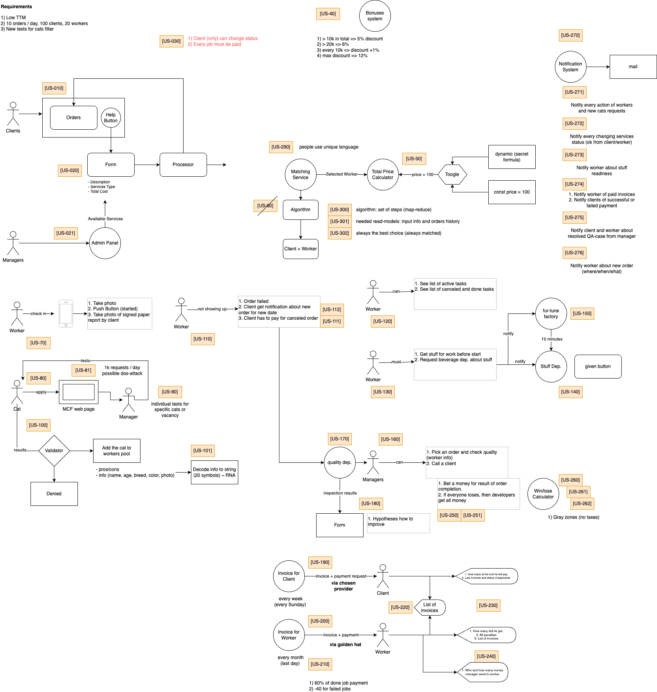

# Анализ систем

Проектируем системы правильно. 

### Содержание

0. [Нулевое задание](v0.9/README.md)
1. [Первое задание](v1.0/README.md)
   - [Первое задание (обновлено)](v1.1/README.md)
2. [Второе задание](v2.0/README.md)
   - [Второе задание (обновлено)](v2.1/README.md)
3. [Третье задание](v3.0/README.md)
   - [Третье задание (обновлено)](v3.1/README.md)
4. [Четвертое задание](v4.0/README.md)
   - [Четвертое задание (обновлено)](v4.1/README.md)

### Пользовательские истории

