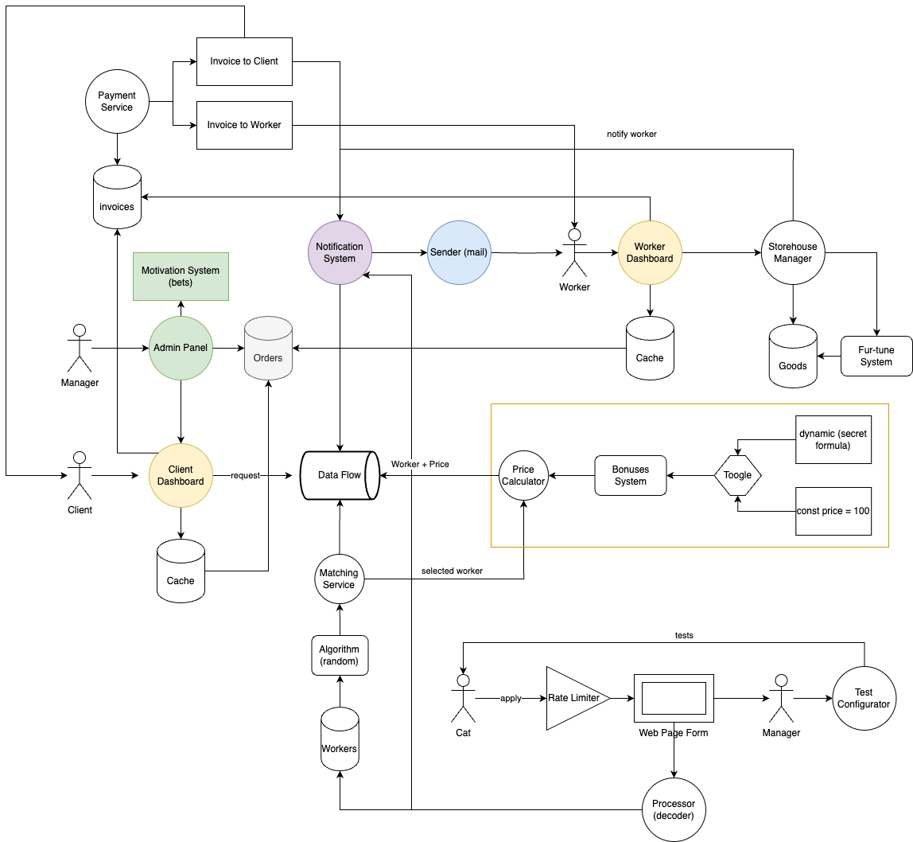

### Структура системы

Архитектура системы

### Описание решений

Система моделировалась фактически из разных доменов. В отдельные сервисы или части была вынесена единообразная логика таким образом, чтобы конкретный модуль работал только в своей зоне ответственности и отвечал за то, что от него ожидают. 

С текущими вводными система выглядит как монолит совмещенный с микросервисами, в которые будут вынесена отдельная логика по работе, например, с матчингом воркеров с клиентом, подсчета цены, отправки уведомлений на почту, платежный сервис и другие. Монолит может потребоваться в связи с тем, что при текущих вводных могут происходить неоднозначные взаимодействия с базой данных, а микросервисная архитектура предполагает отдельную БД для каждого сервиса. 

Для шины данных (на схеме `Data Flow`) выбран **асинхронный** обмен сообщениями, так как одновременно несколько клиентов/сервисов должны будут вычитывать события и совершать определенную работу. Остальные взаимодействия (в том числе межсервисные) предусмотрены **синхронными**. 

Основной вопрос в том, почему согласно [US-030] "Статусы задачи может менять только клиент."? От этого может существенно поменяться архитектура предлагаемой системы, это выглядит небезопасно и может привести к нежелательным эффектам. Также непонятно почему [US-110] предлагает клиенту платить за не состоявшийся заказ, но это может быть обусловлено бизнес-требованиями, которыми мы не управляем. 