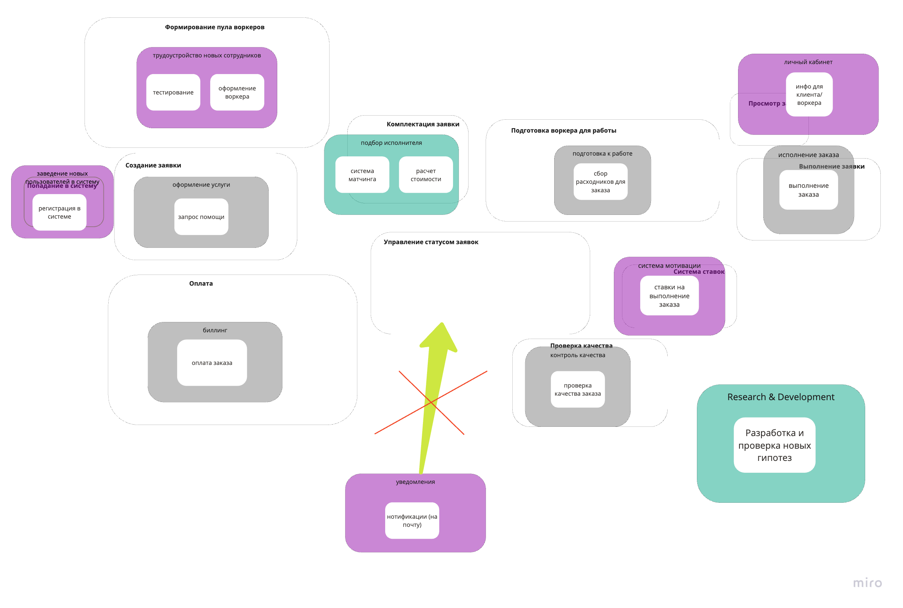
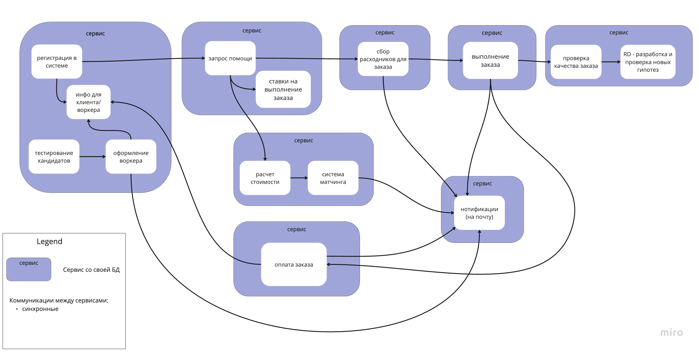

# Работа с требованиями, разделение системы на элементы

### Выписал следующие поддомены:
- Регистрация в системе - точка входа, которую важно выделить отдельно и она выглядит независимо.
- Запрос помощи и ее админка - 2 связанных поддомена, решающих конкретную задачу (помощь клиенту).
- Система матчинга - понятный поддомен (тем более внутри него люди говорят на своем языке).
- Расчет стоимости - выглядит как отдельная функция для решения определенной задачи.
- Сбор расходников для заказа - довольно широкий, но понятный для выделения поддомен.
- Оплата заказа - поддомен для выставления инвойсов и работы с деньгами.
- Тестирование новых сотрудников MCF - выглядит как отдельный поддомен с уникальной логикой. Связанный с ним - админка MCF. Решил их разделить, так как админка имеет определенную специфику, которую можно отдать на аутсорс.
- Оформление рабочего - выглядит как отдельный и самостоятельный процесс, поэтому был вынесен в отдельный поддомен.
- Проверка качества заказа - самостоятельный поддомен (решает определенную проблему).
- Выполнение заказа - понятный поддомен, в рамках которого исполнитель работает с текущим заказом.
- Система ставок - независимый поддомен для работы со ставками. Очевидно, может иметь специфический язык.
- Нотификации - поддомен для работы с уведомлениями.
- Информация для клиента и для воркера - 2 похожих поддомена, которые отвечают за отображения информации по заказам. Аналог личного кабинета.
- Разработка и проверка новых гипотез.

### Типы поддоменов выбирал так:
1. Система матчинга и разработка/проверка гипотез являются уникальным преимуществом компании, поэтому это Core поддомены.
2. К Supporting поддоменам отнес, так как непосредственной ценности для бизнеса не несут, а выполняют поддерживающие функции:
- личный кабинет
- нотификации
- тестирование сотрудников
- оформление воркера
- система ставок
- регистрация в системе
3. К Generic поддоменам отнес следующие, так как влияют на бизнес, не являются критически важными и могут быть приобретены извне:
- расчет стоимости
- оплата заказа
- выполнение заказа
- сбор расходников
- запрос помощи
- проверка качества заказа

### Core Domain Chart

### Bounded context with subdomains

### ES VS Strategy DDD

После сравнения боундед-контекстов из поддоментов с ES у меня не сматчилось 2 контекста.

В ES у меня был довольно спорный контекст по управлению статусом заявок и при этом я не обособлял отдельно довольно важный контекст с уведомлениями. Но с поддоменами было важно выделить нотификации, так как иначе они никуда не попадали. 

Выделяя для проекта важные характеристики и плотно работая с требованиями, заметил, что пропустил в самой первой версии такой контекст как разработка и тестирование новых гипотез.

Таким образом, новые контексты с уведомлениями и с разработкой и проверкой гипотез не нашли себе применение в первоначальной схеме ES, а остальные удалось сматчить. 

### Updated ES and Data Modeling

### Важные характеристики для проекта

Core-функционалом системы является система матчинга (US-060). В первой версии она планируется довольно простой, но в будущем это должно стать конкурентным преимуществом, поэтому важны такие характеристики как:

- Modifiability (для простоты изменений)
- Agility (для масштабного рефакторинга)
- Testability (должна быть тестопригодной после быстрых изменений)
- Deployability (быстрый деплой - быстрый TTM)
- Availability (без этого система не сможет регистрировать новые заявки)

Это позволить легко изменять кор-функционал, тестировать и гарантировать низкий TTM.

Для второго core-функционала (проверка гипотез) важно:

- Scalability (гипотез на старте может накапливаться очень много, важно успевать обрабатывать)
- Securability (не хотим, чтобы инновации утекали)
- Testability (кор-функционал должен быть легко тестируемым)
- Usability (так как это R&D, то удобство важно)

Для Supporting поддоменов будет важно:

- Availability (регистрация в система клиентов очень важна)
- Maintainbility (один из способов обеспечивать доступность при авариях)
- Consistency (так как работаем с нотификациями и другими рид-моделями)
- Simplicity (здесь пользователи работают с интерфейсами)
- Securability (работаем с ПД и не хотим быть за быть заддошенными конкурентами)

Для Generic поддоменов будет важно:

- Consistency (денежные операции)
- Performance (важно, чтобы расчеты выполнялись быстро)
- Securability (работаем с деньгами, поэтому важная характеристика)
- Availability (система должна быть доступна особенно в моменты, когда воркер выполняет заказ)
- Usability (для работы с клиентским заказом услуг)
- Simplicity (важно, чтобы система была понятна воркеру и клиенту)

### Архитектурный стиль

Была выбрана микросервисная архитектура по следующим критериям:
 
1. Ключевым функционалом является система матчинга, но так как она начинает развиваться с простой версии, то крайне вероятны изменения в будущем. Хочется ее обособить в отдельный микросервис, который сможем независимо от других менять/тестировать/деплоить. Плюсом также идет, что команда, разрабатывающая матчинг, использует свою терминологию (US-290), а, может быть, и свой стэк. 
2. Почти для всех поддоменов важна характеристика Securability, а микросервисы смогут обеспечить это лучше всего.
3. Также вижу потребность в нескольких базах данных для обеспечения доступности системы: для клиентов, для воркеров, для заказов, для инвойсов и для гипотез. 

### Итоговая модель системы

### Рефлексия

1. Сложно было подружить 2 понятия: поддомен и баундед контекст. Иногда в ходе поиска поддоменов выделялся контекст и наоборот. Пока сложно между ними однозначное различие провести, но определение, что поддомены обозначают проблему, а баундед контекст - решение, помогает. Возможно, хочется найти какой-то вопрос, с помощью которого будет легко получаться декомпозировать систему на поддомены, а потом объединять все по контекстам. 
2. Очень сложно в ходе выделения поддоменов перестать все объединять в контексты и накидывать новые. 
3. В текущей системе сильно смущает сервис уведомлений. С одной стороны не хочется разрывать контексты, из которых должны посылаться уведомления, а с другой - непонятно как в распределенной системе сделать иначе.  