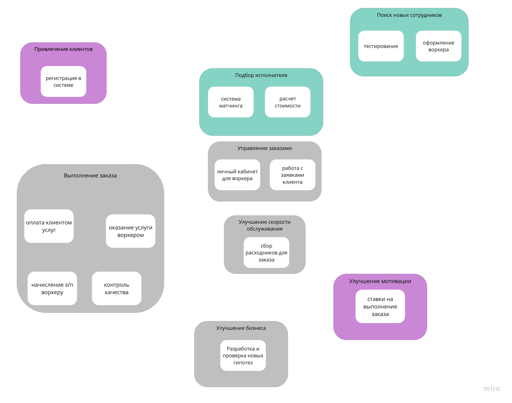

# ADR-001: Выбор архитектурного стиля для Make cats free again (MCF)

### Status

- Accepted

### Context

Основываясь на требованиях и консёрнах стейкхолдеров, было определено, что  необходимо реализовать систему из восьми боундед-контекстов, каждый из которых имеет свой набор характеристик.

Ключевые характеристики:
- deployability (есть фиксированные ограничения к деплою разных модулей)
- fault-tolerance (боимся потерять любую финансовую информацию)
- modularity (некоторые модули работают независимо и задают разные требования к деплою)
- scalability (резко изменилась нагрузка на сервис по количеству заказов, после релиза, вероятно, будет кратное увеличение)
- security (важно соблюсти CatFinComplience)

Кроме характеристик, в системе есть следующие ограничения:
- инфраструктуру считаем бесплатной, прямо как в уроке, так как Happy Cat Box расскажет нам, как такое организовать;
- соблюдение CatFinComplience, который говорит об особом способе хранения данных и особой наблюдаемости за системой. Компания не хочет повторять опыт с маски-шоу, которые были в Happy Cat Box.

### Decision

- микросервисный стиль

Ключевые характеристики были сматчены на 7 видов архитектурных стилей:
[pic](arch-style.png)

Так, что больше всего соответствий получилось у микросервисного стиля (5/5). Следующий в списке шел - event-driven (4/5).

При этом важно отметить, что микросервисы сильно проигрывают по стоимости, связанной с большими расходами на системных администраторов, работы инфраструктуры и прочее, но так как мы работает с ограничением "бесплатная инфраструктура", то этот стиль идеально подошел под нас.

### Сompliance

Соблюдение архитектурного стиля будет автоматизировано проверками. В местах, где автоматизации невозможна, будет введен аудит (например, юридический).