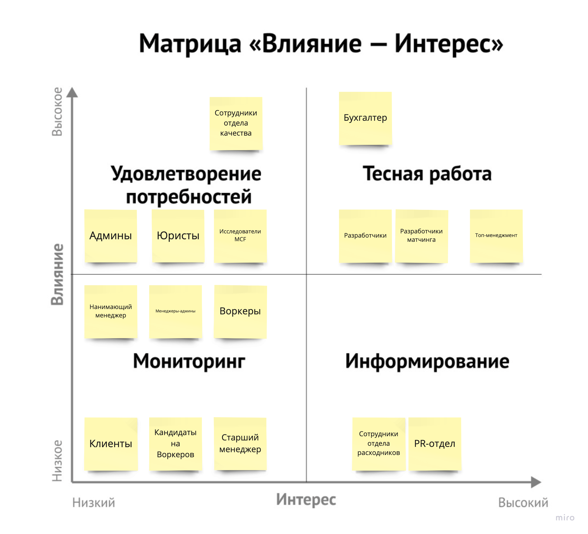
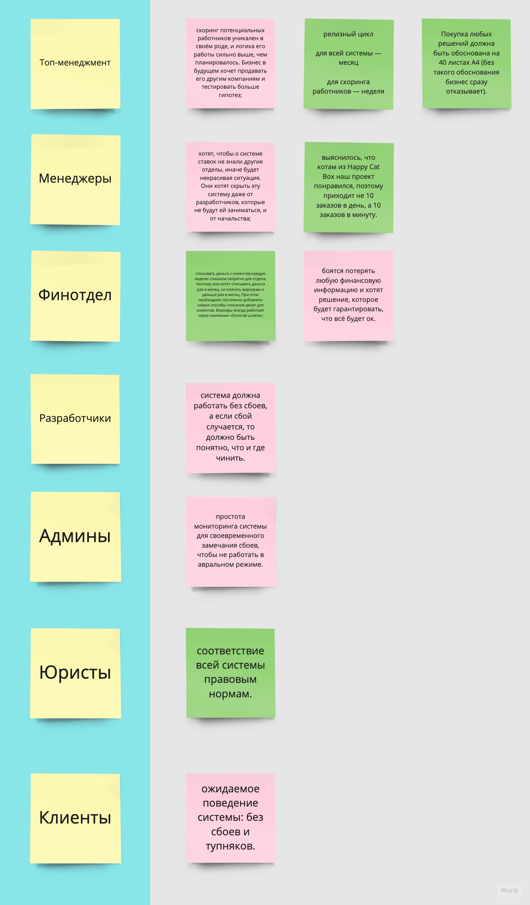
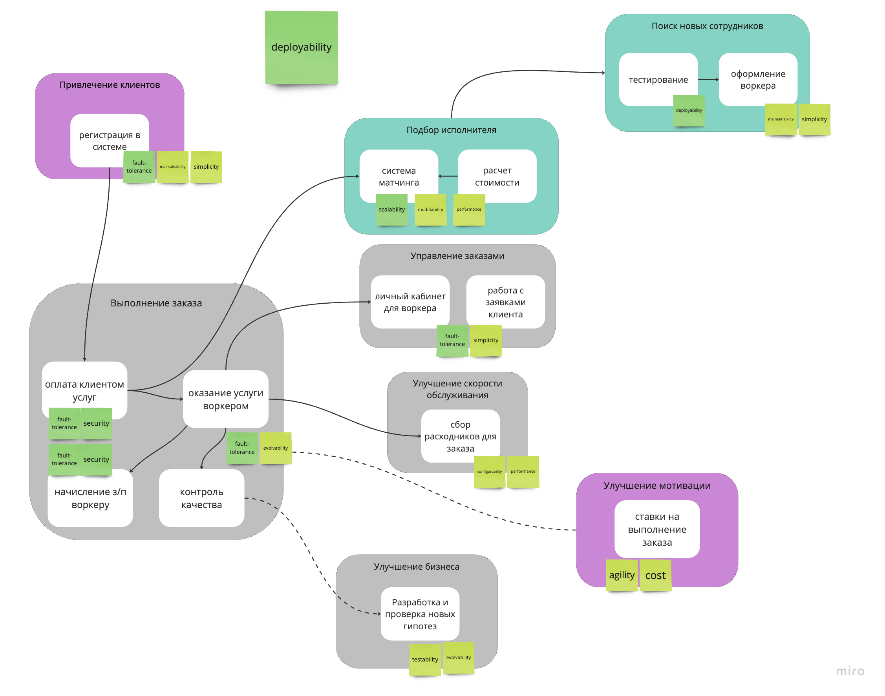

# Выбираем коммуникации, брокеры и базы данных, документируем решения

### Стейкхолдеры

Потенциально могли забыть:
- поставщики печенье (fur-tune)
- инвесторы компании (если есть)

### Архитектурный стиль

Был произведен анализ основных требований и консернов стейкхолдеров (см. таблицу), поэтому для всей системы был выбран микросервисный стиль. 

В принятии решения сильно помогло допущение о бесплатной архитектуре. В микросервисах работа с инфрой является одним из основных недостатков. 

Также были приняты во внимание консерны, на основании которых были выведены ключевые характеристики:
- deployability (есть фиксированные ограничения к деплою разных модулей)
- fault-tolerance (боимся потерять любую финансовую информацию)
- modularity (некоторые модули работают независимо и задают разные требования к деплою)
- scalability (резко изменилась нагрузка на сервис по количеству заказов, после релиза, вероятно, будет кратное увеличение)
- security (важно соблюсти CatFinComplience)

Это ^ ключевые характеристики, вытекающие из требований, очевидно, что важны также и другие, но приоритет меньше, поэтому в выборе архитектуре они не участвовали в связи с отсутствием спорных ситуаций на этой итерации. 

Предполагаются следующие сервисы:
- Сервис-фасад, предоставляющий возможность зарегистрироваться в системе. Он должен быть простой и дешевый, поэтому монолит. 
- Сервис по расчету стоимости будет представлен с архитектурой event-driven, так как основной характеристикой будут являться fault-tolerance и performance
- Сервис по мэтчингу будет представлять собой микросервисную архитектуру, так как должен легко изменяться и масштабироваться. 
- Скоринг сотрудников (тестирование и оформление новых воркеров) будет представлять собой микросервисную архитектуру, так как важно раз в неделю деплоить.
- Сервис по управлению заказами для клиента и воркера должен быть простым, поэтому монолит. 
- Сервис по сбору расходников для заказа имеет много разных зависимостей и должен легко конфигурироваться. Поэтому выбираем microkernel.
- Сервис по улучшению мотивации должен быть максимально дешевым и простым, поэтому монолит. 
- Сервис для улучшения бизнеса делаем тестопригодным и легко развиваемым, поэтому выбираем микросервисы. 
- Самый богатый на контексты поддомен "Выполнение заказа". Для каждого из контекста важным является устойчивость к ошибкам и безопасность. Руководствуясь этими характеристиками, выбираем микросервисы для каждого из следующий контекстов: оплата клиентом услуг и начисление з/п воркеру; оказание услуги воркером; контроль качества. 

### Базы данных

Выбор баз данных от соответствующих критериев представлен в таблице.

|Название сервиса|Критерии выбора|Тип базы данных|
|---|---|---|
|Регистрация в системе|простота и консистентность данных|RDBMS|
|Расчет стоимости|производительность и масштабируемость|Column Family|
|Мэтчинг исполнителей|изменчивость и масштабируемость|NoSQL|
|Скоринг сотрудников|производительность и доступность|NoSQL|
|Управление заказов|простота и консистентность|RDBMS|
|Сбор расходников|простота и консистентность|RDBMS|
|Ставки на заказ|простота и стоимость|RDBMS|
|Тестирование гипотез|простота|RDBMS|
|Начисление и списание денег|важна консистентность данных|RDBMS|
|Оказание услуги|запись превышает чтение|Key-Value|
|Контроль качества|простота и консистентность|RDBMS|

### Коммуникации

Для большинства сервисов будет использоваться синхронный вид коммуникации. За исключением:
- Сервис по совершению ставок на заказы будет работать асинхронно с другими сервисами, так как он независим и не предоставляет никакого респонса или данных для других.
- Сервис по контролю качества будет общаться с сервисом по тестированию гипотез асинхронно, так как последний является независимым клиентом определенных событий (таких как: новый репорт о несостоявшемся заказе).  

Асинхронные коммуникации организуются по стилю Event-driven, в то время как синхронные по Request-response. 

### Фитнес-функции

Для валидации готовой системы будем использовать:

- Инструменты, сигнализирующие о частоте деплое разных модулей (в перспективе создание дашбордов).
- Code-coverage на всех модулях в зависимости от критичности от 60-90%.
- Интеграционные тесты, E2E, которые будут запускаться при выкатке очередного сервиса/монолита в прод для проверки стабильности. 
- Нагрузочное тестирование на критически важные сервисы для проверки отказоустойчивости.
- Линтеры и дополнительные автосканы, чтобы регулярно проверять систему на наличие уязвимостей и дыр в безопасности.
- Автотесты на следование принятым архитектурным стилям (или регулярный аудит).
- Метрики на скорость поставки новых фич (от идеи до прода), чтобы измерять TTM.
- Отдельным запросом от юристов было: соответствие всем нормам, поэтому для этих целей будет введен регулярный аудит или плотная работа с юристами на этапе разработке каждой отдельной фичи.

### ADR

[Читать документ](ADR-001.md)