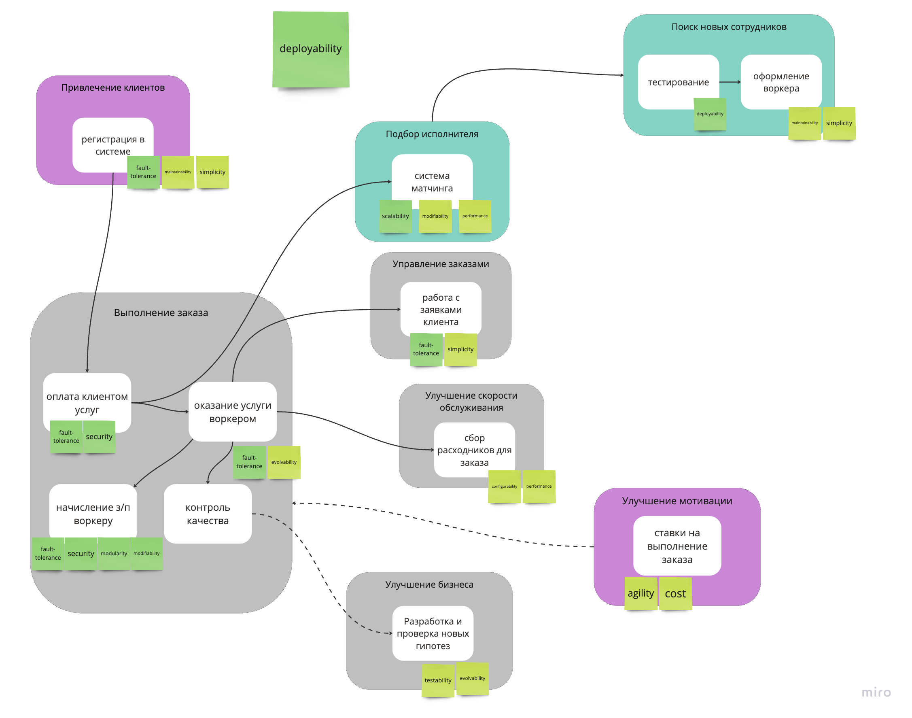

# Выбираем коммуникации, брокеры и базы данных, документируем решения

### Изменения по сравнению с v3.0

Убираем технические шаги:
- Удален шаг "расчет стоимости" из контекста "Подбор исполнителя"
- Удален шаг "личный кабинет для воркера" из "Управление заказами" (UI не является отдельным контекстом, так как завязан на API "Управления заказами")

Общий микросервис "оплата клиентом услуг" и "начисление з/п воркеру" делим на 2 независимых, так как они должны удовлетворять **разным характеристикам**. Так сервис по начислению з/п воркеру должен уметь легко тестировать новые способы начисления. Плюс разделение баз уменьшит связанность на уровне данных, иначе нас могут ожидать сложности при измении процессов в одном из контекстов. 

