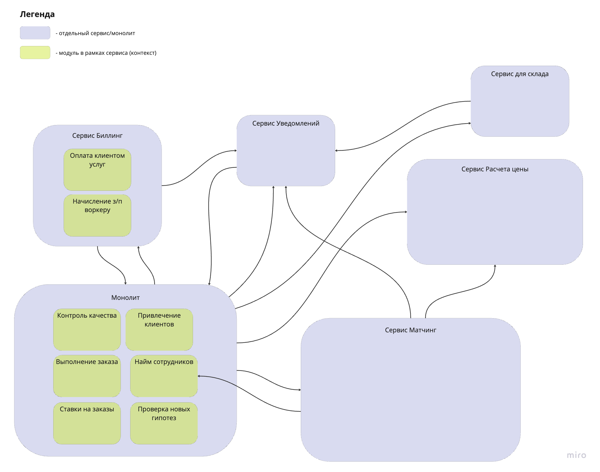
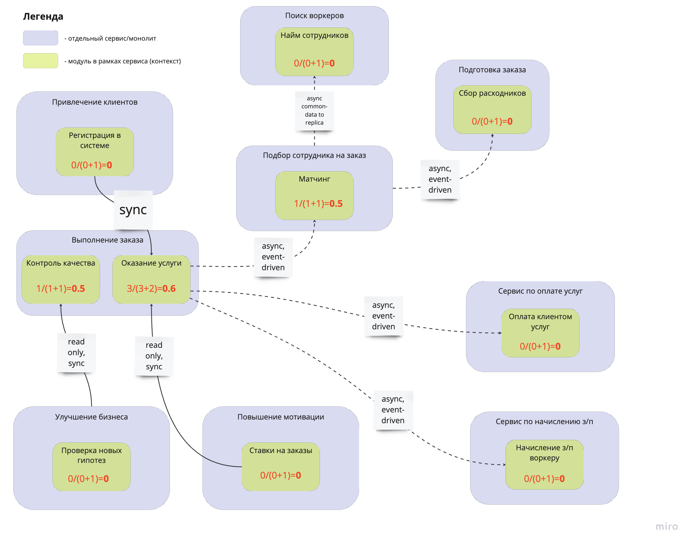
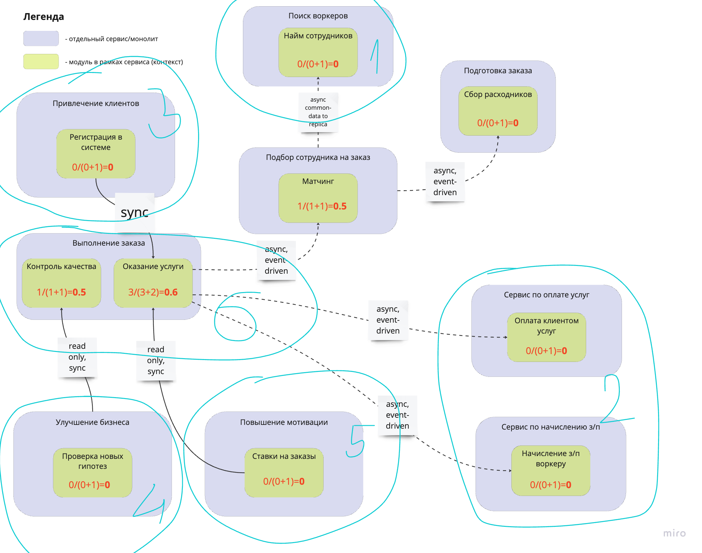
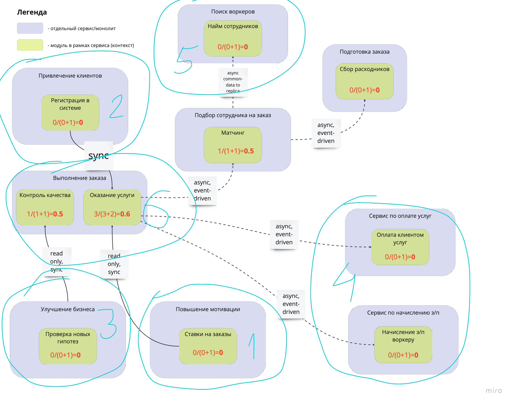

# Распиливаем монолит

### Дисклеймер

Изначально [нулевая версия системы](../v0.9/design.png) выглядела немного сумбурно, поэтому была переделана в удобочитаемый вид для последующего анализа.

Также были добавлены неучтенные модули. 

### Считаем instability

На схеме произведен вынос модулей в отдельные микросервисы и посчитан instability (красным).

### Изменение сервисов в системе

Избавляемся от следующих сервисов:
1. Сервис уведомлений, так как происходит разрыв контекста и при таком подходе получаем большую связанность системы. Лучше всего будет бизнес-логику по отправке уведомлений вынести в отдельные сервисы и сделать общую библиотеку для транспорта.
2. Сервис расчета цены фактически является техническим шагом и был перенесен в поддомен "Выполнение заказа". 

Сервис биллинга разделяем на 2 микросервиса. Это важно, так как у них разные характеристики (сервис по начислению з/п будет меняться чаще). 

Важно из монолита было вынести:
1. Сервис для привлечения клиентов (generic -> supporting поддомен)
2. Сервис для повышения мотивации (generic -> supporting поддомен)
3. Сервис для улучшения бизнеса (generic поддомен)
4. Сервис для поиска воркеров (generic -> core поддомен)

В конечном монолите остаются только ограниченные контексты по контролю качества и оказанию услуги, так как имеют большую связанность между друг другом и удовлетворяют одинаковым характеристикам. 

### Последовательность работ

В описанных ниже шагах опущены важные этапы выноса по распилу монолита, то есть фактически обозначен план и приоритет по выносу сервисов. Важно добавить, что плану должен предшествовать тщательный анализ всех требований и решаемых проблем, основываясь на архитектурных решениях. 

По окончании каждого шага важно производить валидацию работоспособности, включая интеграционное тестирование.

Окончательной ликвидации техдолга будет предшествовать этап пусконаладки, где будем интеграционно смотреть на всю систему, отлавливать баги и делать фиксы.

#### Кейс 1 - нет свободных людей и ресурсов, а опыт и (или) инфраструктура есть

Шаги:
1. Начинаем с выноса критически важной логики. Так как у нас сервис для поиска воркеров перешел в core поддомен, то есть является уникальным преимуществом бизнеса, то начинаем с него. 
2. Не забываем про интеграции. Потенциально самая тяжелая у нас - в сервисах по оплате услуг и начислению з/п. На этом шаге выносим их. 
3. Далее выносим supporting поддомен "Привлечение клиентов" как потенциально простой, но значимый.
4. Выносим generic поддомен "Улучшение бизнеса"
5. Заканчиваем вынос supporting поддоменом "Повышение мотивации", как самый низкоприоритетный (так как использует серые схемы и вообще сомнительный).
6. От сервисов уведомлений и расчета цены избавляемся в рамках техдолга. 

В зависимости от способа распила монолита последний шаг может включить другие работы по техдолгу. 

#### Кейс 2 - есть свободные люди и ресурсы, а опыта и (или) инфраструктуры нет

Фактически идем в обратном порядке, чем в Кейсе 1. 

Шаги:
1. Важно набираться опыта и постепенно выстраивать инфраструктуру, поэтому начинаем с технически простого поддомена supporting "Повышение мотивации".
2. Далее идет "Привлечение клиентов". Как следующий по приоритету, но более нагруженный. 
3. Далее двигаемся по generic поддоменам. Выносим поддомен для "Улучшения бизнеса". 
4. Когда появился опыт и уже какой-то костяк инфраструктуры, то можем постепенно заниматься интеграцией более сложных платежных решений. Выносим сервисы по оплате услуг и начислению з/п. 
5. Подобрались к самому важному для выноса сервиса core поддомена - "Поиск воркеров". Инфраструктура уже есть, опыт тоже - выносим и его. 
6. В рамках техдолга избавляемся от ненужных сервисов, производим оставшиеся работы по настройке инфры. 