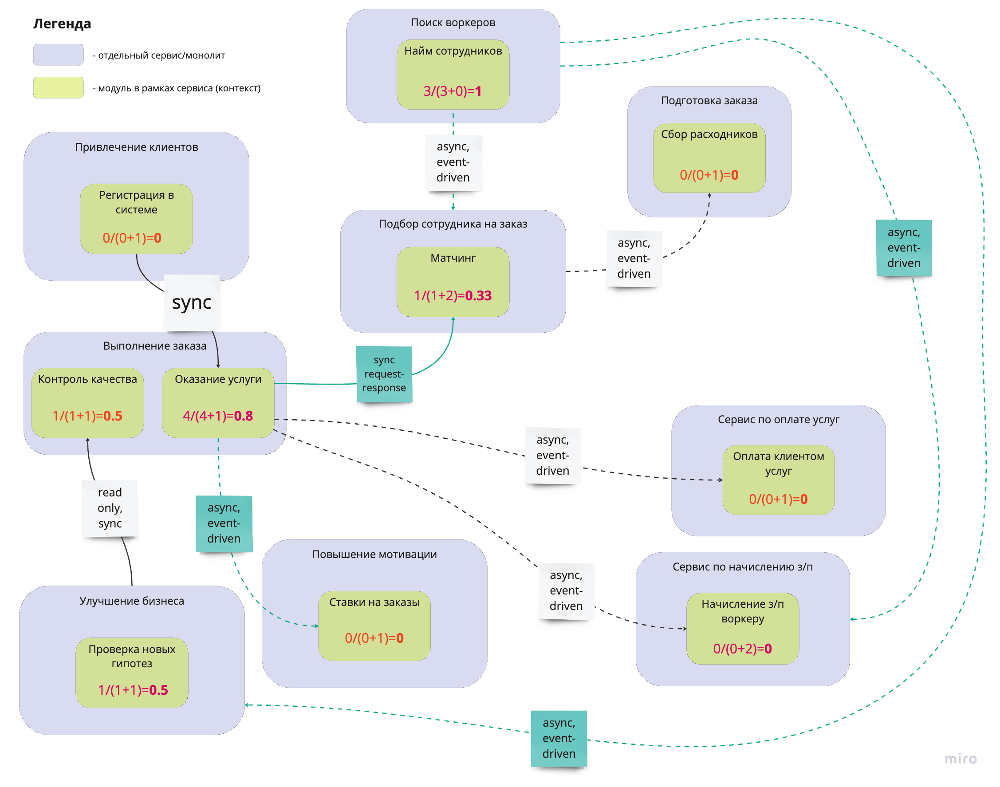

# Распиливаем монолит

### Схема после выноса

### Изменения по сравнению с v4.0

- Сервис по поиску воркеров будет посылать всем потребителям асинхронные события. Потребители (сервисы): подбор сотрудника на заказ, начисление з/п сотруднику и улучшение бизнеса.
- Сервис по матчингу должен быть синхронным, то есть работать по типу request-response, чтобы быстрее оформить заказ.
- Сервис принимающий ставки на заказы будет подписан на изменения о смене статусов заказа. 
- Для всех сервисов, где были изменены связи, пересчитан instability.
