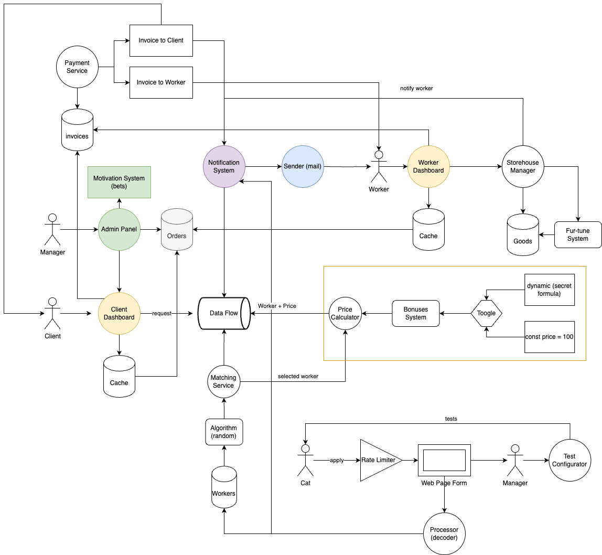
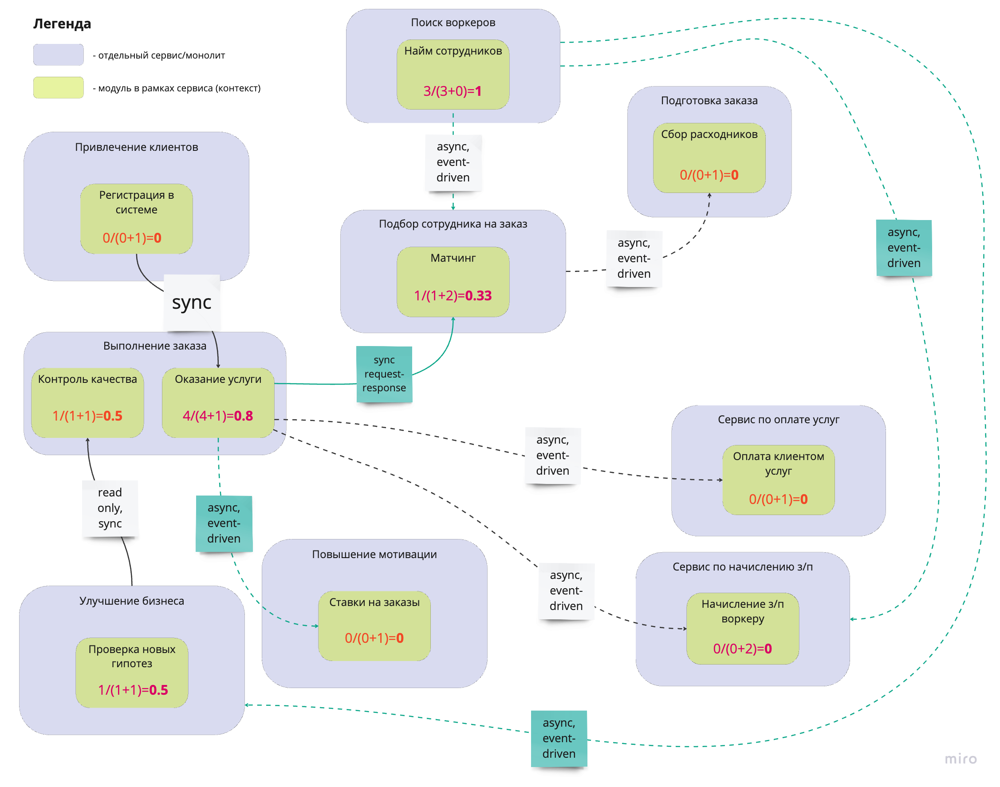

# Рефлексия 

### Сравниваем систему v0.9 и v4.1

### Что сделано одинаково

Матчинг воркеров в обоих случаях вынесен в отдельный сервис. Приятно, что удалось сразу правильно определить его место в системе.

### Что сделано иначе в первоначальной системе

1. Непонятно на каком уровне абстракции изображена схема, смешаны: и сервисы, и UI, и RateLimiter, и даже Toogle, который управляет поведением по расчету цены, что затрудняет понимание общей картины. 
2. Подсчет цены вынесен в отдельный сервис, но не разбит на 2. В конечном итоге, стало очевидно, что лучше сделать 2 сервиса с отдельными БД: 1 для начисления з/п воркеру, а другой для оплаты услуги клиентом.
3. На схеме отображены клиентские дашборды, но обособлять их отдельно некорректно, так как сами по себе они не предоставляют какие-либо ендпоинты для взаимодействия с остальными частями системы, а являются лишь UI. Соответствующие ендпоинты существуют в отдельных сервисах, как, например, "Выполнение заказа".
4. Система нотификаций была вынесена отдельно, но сейчас от нее полностью отказались, так иначе она создает большую связанность и перегружается разными бизнесовыми контекстами. 
5. На схеме не учтен сервис по Регистрации клиентов в системе, а это являлось одним из требований.
6. Существовал сервис для подсчета цены, но в конечном итоге стало понятно, что это один из технических шагов, поэтому не корректно держать его отдельно. 
7. Тип коммуникации отображен одинаково для синхронного и асинхронного обмена, из-за чего непонятно как происходит обмен данными. 

### Идеи и подходы, которые интересно внедрить в будущем

1. Думать на уровне поддоменов и ограниченных контекстов. Понравилось, что такой подход учит собирать конкретный бизнесовый контекст, вытекающий из требований к системе, в одном месте. Мыслить на уровне поддоменов - выглядит как системный подход к анализу и проектированию любой системы. 
2. Event Storming обязательно станет одним из постоянных инструментов в моем арсенале. Интересно его попробовать применить в своей команде для проектирования новой системы.
3. Не всегда одинаковые по смыслу системы, например, в домене биллинга, должны располагаться в одном микросервисе. Иногда полезно их разделить. Тут важно смотреть на контекст, в котором они существуют. Возможно, он очень специфичный для каждой из систем. 
4. Характеристики системы определяют архитектурный стиль, а также помогают при распиле монолита.  
5. Каждое требование важно. Нужно прорабатывать каждый консерн стейкхолдеров и каждый пункт требований еще на моменте анализа.
6. При наличии неопределенности в требованиях и любых сомнениях по работе будущей системы - задавайте вопросы.
7. Оставляем артефакты принятых решений. В идеале - делать ADR по каждому.
